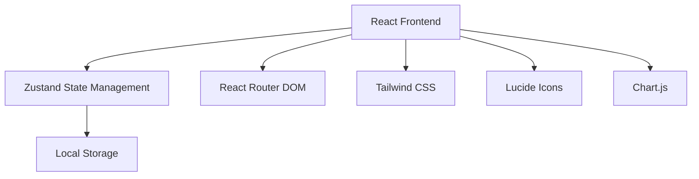

# 赚钱小游戏记录工具 - 技术架构文档

## 1. Architecture Design


## 2. Technology Description
- Frontend: React@18 + TypeScript + tailwindcss@3 + vite
- Initialization Tool: vite-init (react-ts template)
- Backend: None (纯前端应用，本地存储)
- Database: LocalStorage
- Charts: Chart.js + react-chartjs-2
- State Management: Zustand
- Icons: Lucide React

## 3. Route Definitions
| Route | Purpose |
|-------|---------|
| / | 仪表盘 (Dashboard) - 收益概览和快速操作 |
| /games | 游戏管理 (Games) - 管理所有游戏 |
| /records | 收益记录 (Records) - 查看和添加收益记录 |
| /analytics | 数据分析 (Analytics) - 图表和统计分析 |
| /goals | 目标设定 (Goals) - 设置和追踪目标 |
| /settings | 设置 (Settings) - 应用配置和数据管理 |

## 4. Data Model
### 4.1 Data Structures

```typescript
// 游戏数据模型
interface Game {
  id: string;
  name: string;
  icon: string; // 图标emoji或名称
  color: string; // 主题色
  tags: string[]; // 标签
  description?: string;
  createdAt: number; // 时间戳
  updatedAt: number;
}

// 收益记录模型
interface Record {
  id: string;
  gameId: string;
  amount: number;
  type: 'income' | 'withdraw';
  date: string; // ISO日期
  note?: string;
  createdAt: number;
}

// 目标模型
interface Goal {
  id: string;
  type: 'monthly' | 'yearly' | 'custom';
  amount: number;
  current: number;
  period: string; // 期间标识
  description?: string;
  createdAt: number;
}

// 应用状态
interface AppState {
  games: Game[];
  records: Record[];
  goals: Goal[];
  theme: string;
  settings: {
    currency: string;
    dateFormat: string;
  };
}
```

## 5. File Structure
```
/workspace
├── src/
│   ├── components/
│   │   ├── Layout.tsx           # 页面布局组件
│   │   ├── StatCard.tsx         # 统计卡片组件
│   │   ├── GameCard.tsx         # 游戏卡片组件
│   │   ├── RecordItem.tsx       # 记录项组件
│   │   ├── ThemeSwitcher.tsx    # 主题切换组件
│   │   └── Modal.tsx            # 通用模态框组件
│   ├── pages/
│   │   ├── Dashboard.tsx        # 仪表盘页面
│   │   ├── Games.tsx            # 游戏管理页面
│   │   ├── Records.tsx          # 收益记录页面
│   │   ├── Analytics.tsx        # 数据分析页面
│   │   ├── Goals.tsx            # 目标设定页面
│   │   └── Settings.tsx         # 设置页面
│   ├── store/
│   │   └── useStore.ts          # Zustand状态管理
│   ├── hooks/
│   │   └── useLocalStorage.ts   # 本地存储Hook
│   ├── utils/
│   │   ├── formatters.ts        # 格式化工具
│   │   ├── constants.ts         # 常量定义
│   │   └── themes.ts            # 主题配置
│   ├── types/
│   │   └── index.ts             # TypeScript类型定义
│   ├── App.tsx                  # 应用入口组件
│   ├── main.tsx                 # React入口文件
│   └── index.css                # 全局样式
├── package.json
├── vite.config.ts
├── tailwind.config.js
├── tsconfig.json
└── postcss.config.js
```

## 6. State Management
使用Zustand进行状态管理，数据通过useLocalStorage Hook自动持久化到LocalStorage。

## 7. Theme System
多主题支持，包括：
- 默认主题 (青粉渐变)
- 暗夜主题
- 清新主题
- 暖金主题
- 海洋主题
